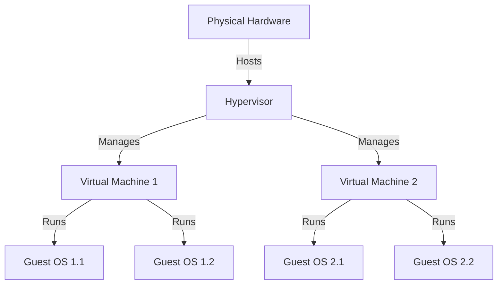

# History of Virtualization

## Atlas

When we think of virtualization, we typically think of VMWare's Horizon Client and our office virtual machine, however we need to dig a few decades back to find how virtualization got started. The first instance of virtualization of hardware occurred in the 1950s, with the Atlas Manchester supercomputer. Although not a case of full virtualization, the Atlas Manchester implemented a virtual memory technique allowing it to gain more memory without upgrading its hardware. The Atlas implemented a paging technique, enabling main memory access to disk storage. [Wikipedia, Atlas](<https://en.wikipedia.org/wiki/Atlas_(computer)>)

## IBM CP-40

As the first version of the CP/CMS (Control Program/Cambridge Monitor System), the CP-40 entered production use in 1967. The CP-40 is an important step in the history of virtualization, as it was the first instance where full virtualization was the intent. The CP-40 was the first operating system which provided a virtual machine environment capable of supporting the installation, testing, and use of other operating systems under the same IBM S/360 umbrella. [Wikipedia, IBM CP-40](https://en.wikipedia.org/wiki/IBM_CP-40)

## HyperVisors

Things start getting more interesting. Hypervisor architecture is introduced in the 1970s by Robert P Goldberg. In the classic "Architectural Principles for Virtual Computer Systems," he came up with 2 types of hypervisors, affectionately named Type 1 and Type 2. Type 1 Hypervisors run on the hardware itself - this includes the aforementioned IBM systems. Type 2 is software. You install it on an OS and then use it to run more OS's from the same OS. Consider the below Hypervisor diagram. The Physical Hardware hosts a hypervisor. The hypervisor manages the lifecycles of two virtual machines. Each of these virtual machines contains multiple virtual guest OS's. [Architectural Principles for Virtual Computer Systems](https://www.semanticscholar.org/paper/Architectural-Principles-for-Virtual-Computer-Goldberg/ff4af2d7195f109f86e1cfa326b5c25d19e3e1b1)

## 1980s

## Additional Sources

[What is Virtualization? By Redhat](https://www.redhat.com/en/topics/virtualization/what-is-virtualization#history-of-virtualization)

[Virtualization Documenation](https://learn.microsoft.com/en-us/virtualization/)
