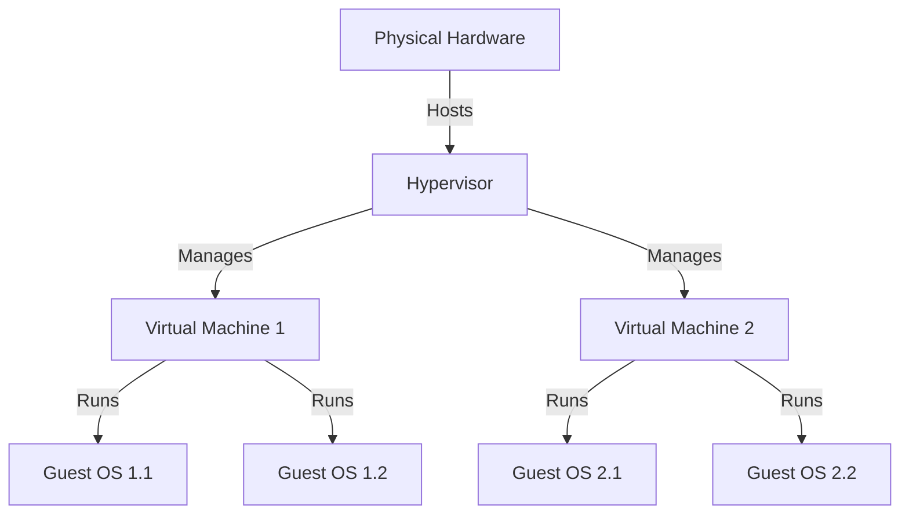

# History of Virtualization

## 1950s - a few years ago

### Atlas

When we think of virtualization, we typically think of VMWare's Horizon Client and our office virtual machine, however we need to dig a few decades back to find how virtualization got started. The first instance of virtualization of hardware occurred in the 1950s, with the Atlas Manchester supercomputer. Although not a case of full virtualization, the Atlas Manchester implemented a virtual memory technique allowing it to gain more memory without upgrading its hardware. The Atlas implemented a paging technique, enabling main memory access to disk storage. [Wikipedia, Atlas](<https://en.wikipedia.org/wiki/Atlas_(computer)>)

### IBM CP-40

As the first version of the CP/CMS (Control Program/Cambridge Monitor System), the CP-40 entered production use in 1967. The CP-40 is an important step in the history of virtualization, as it was the first instance where full virtualization was the intent. The CP-40 was the first operating system which provided a virtual machine environment capable of supporting the installation, testing, and use of other operating systems under the same IBM S/360 umbrella. [Wikipedia, IBM CP-40](https://en.wikipedia.org/wiki/IBM_CP-40)

### HyperVisors

Things start getting more interesting in the 1970s when hypervisor architecture is introduced by Robert P Goldberg. In the classic "Architectural Principles for Virtual Computer Systems," he came up with 2 types of hypervisors, affectionately named Type 1 and Type 2. Type 1 Hypervisors run on the hardware itself - this includes the aforementioned IBM systems. Type 2 is software. You install it in an OS and then use the hypervisor software to run more OS's from the same OS. Consider the below diagram. The Physical Hardware hosts a hypervisor. The hypervisor manages the lifecycles of two virtual machines. Each of these virtual machines contains multiple virtual guest OS's. [Architectural Principles for Virtual Computer Systems](https://www.semanticscholar.org/paper/Architectural-Principles-for-Virtual-Computer-Goldberg/ff4af2d7195f109f86e1cfa326b5c25d19e3e1b1)

### 1980s & 90s

In the 1980s, further advancements included running virtual Intel 8086 guest OSs on Unix systems, using Microsoft Flight Simulator as a barometer of progress, and the emulation of x86 on an Apple Macintosh.
In 1999 VMWare introduces the VMWare Virtual Platform, inching us closer to the virtual desktops of today. This is significant but we aren't going to spend a bunch of time on it. If you understand that virtualization is all about rewriting hardware as software code, we're on the right track.

### The Age of VmWare

VMWare Server, a free machine-level virtualization product is released for servers in the early 2000s. It was a hit. Emboldened by the success of this bet, VMWare went on to produce multiple popular virtualization products like the Horizon Client, which many are familiar with through office use, and VMWare Tanzu. To learn more about VMWare, check out this [banger](https://tanzu.vmware.com/content/videos/vmware-tanzu-golden-pitch).

## Clouds w/ a % of horses

Cloud Computing is an American Thoroughbred racehorse who won the 2017 Preakness Stakes. Unbelievably, it was only his 4th start.

According to Wikipedia, it is the on demand availability of computer system resources, especially data storage and computer power. Ultimately, it's a collection of resources in one spot. Swathes of companies all subscribe to those resources. Resources are just virtualized instances of things like databases, compute power mechanisms, network architecturs...etc. This isn't comprehensive. Check out the plethora of articles on [Learn](https://learn.microsoft.com/) for the details.

## Containers

Containerization is a crucial concept in platform engineering, especially when considering cloud services like Microsoft Azure. It involves encapsulating an application and its dependencies in a container, which unlike traditional virtual machines, shares the host's kernel and isolates the application environment. This approach leads to efficient and portable units, allowing applications to run consistently across different environments, including local machines, data centers, or cloud platforms like Azure.

Azure offers services like Azure Container Instances (ACI) and Azure Kubernetes Service (AKS) for containerization. ACI provides a simple environment for running containers without managing virtual machines, suitable for isolated applications. AKS, a managed Kubernetes service, automates deploying, scaling, and managing containerized applications, handling tasks like load balancing and multi-host orchestration. These services solve common deployment issues and support cloud-native development.

Using containerization with Azure streamlines the deployment of applications, adhering to microservices architecture and supporting DevOps practices. It offers tools for orchestration, continuous integration, and deployment, enhancing efficiency in software development and operations. This integration of containerization with Azure services represents a significant trend in software deployment and management in cloud environments. [Containerization on Wikipedia](<https://en.wikipedia.org/wiki/Containerization_(computing)>)

## Additional Sources

[What is Virtualization? By Redhat](https://www.redhat.com/en/topics/virtualization/what-is-virtualization#history-of-virtualization)

[Virtualization Documenation](https://learn.microsoft.com/en-us/virtualization/)
