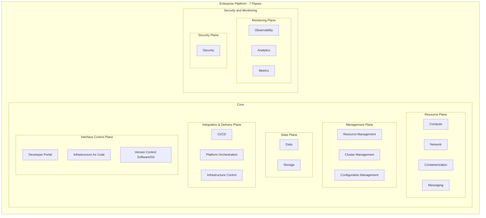
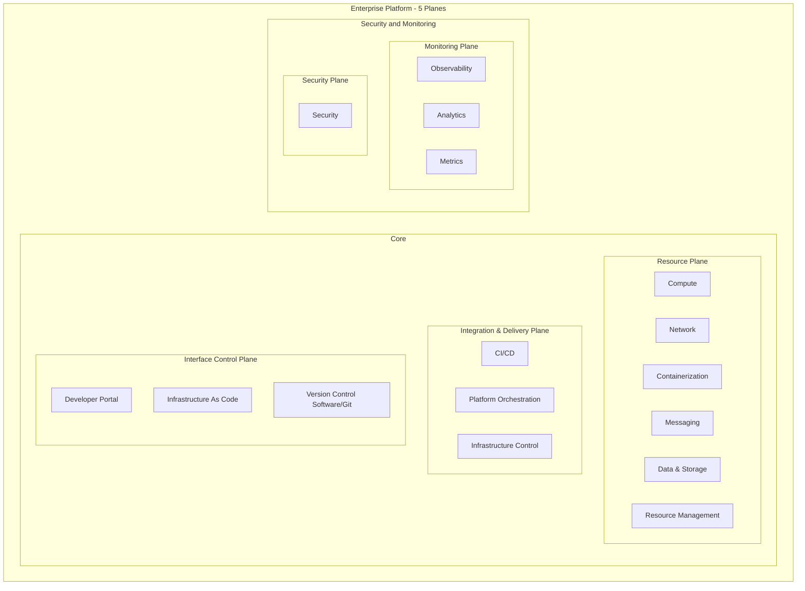

# Platform Architecture

## 7 Planes

```mermaid
flowchart TD

    subgraph EnterprisePlatform[Enterprise Platform - 7 Planes]
        subgraph CorePlatform[Core]
            subgraph ResourcePlane[Resource Plane]
                Compute[Compute]
                Network[Network]
                Containers[Containerization]
                sbus[Messaging]
            end
            subgraph ManagementPlane[Management Plane]
                ResourceManagement[Resource Management]
                ClusterManagement[Cluster Management]
                ConfigMgmt[Configuration Management]
            end

            subgraph StatePlane[State Plane]
                Data[Data]
                Storage[Storage]
            end

            subgraph IntegrationDeliveryPlane[Integration & Delivery Plane]
                CICD[CI/CD]
                Orchestration[Platform Orchestration]
                InfrastructureControl[Infrastructure Control]
            end

            subgraph InterfaceControlPlane[Interface Control Plane]
                Developers[Developer Portal]
                Infra[Infrastructure As Code]
                VCS[Version Control Software/Git]
            end
        end
        subgraph AdditionalPlanes[Security and Monitoring]
            subgraph MonitoringPlane[Monitoring Plane]
                Observe[Observability]
                Analytics[Analytics]
                Metrics[Metrics]
            end
            subgraph SecurityPlane[Security Plane]
                Security[Security]
            end
        end
    end
```

## 5 Planes

```mermaid
flowchart TD

    subgraph EnterprisePlatform[Enterprise Platform - 5 Planes]
        subgraph Core[Core]
            subgraph ResourcePlane[Resource Plane]
                Compute[Compute]
                Network[Network]
                Containers[Containerization]
                sbus[Messaging]
                Data[Data & Storage]
                ResourceManagement[Resource Management]
            end

            subgraph IntegrationDeliveryPlane[Integration & Delivery Plane]
                CICD[CI/CD]
                Orchestration[Platform Orchestration]
                InfrastructureControl[Infrastructure Control]
            end

            subgraph InterfaceControlPlane[Interface Control Plane]
                Developers[Developer Portal]
                Infra[Infrastructure As Code]
                VCS[Version Control Software/Git]
            end

        end
            subgraph AdditionalPlanes[Security and Monitoring]
                subgraph MonitoringPlane[Monitoring Plane]
                    Observe[Observability]
                    Analytics[Analytics]
                    Metrics[Metrics]
                end
                subgraph SecurityPlane[Security Plane]
                    Security[Security]
                end
            end
    end
```
